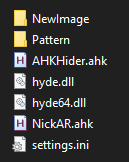
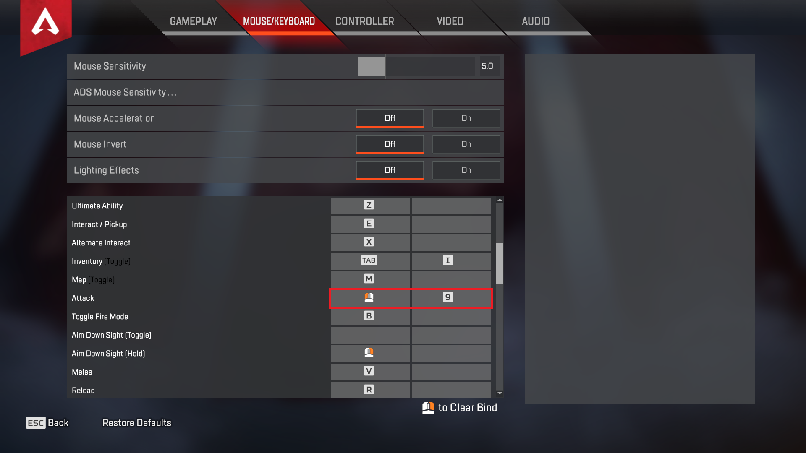

# ApexAHK-Reduce-recoil
I'm making AHK script with auto detect weapon function. This script work fine but have some issue.
I think I would share this script so that everyone can help to improve this script.
I implement from [Updated [Apex Legends NoRecoil Script] - PART 2](https://www.unknowncheats.me/forum/apex-legends/328576-updated-apex-legends-norecoil-script-2-a.html)  and some GitHub ( GitHub link removed because it break the UC rule )
Anyone please leave a problem that u found so I can fix that problem. But I know the recoil pattern is so wried. I will make it better but now I focused on making the auto detect weapon function work perfectly. 

[Original thread](https://www.unknowncheats.me/forum/apex-legends/466312-ahk-reduce-recoil-script-auto-detect-weapon.html)

Script now support [Tientie (Vengefulcrop)](https://www.unknowncheats.me/forum/apex-legends/467406-method-generating-recoil-patterns-ahk-script-development-testing.html) reciol patterns generating method. ( You can see pattern example in file PatternExample.txt )

## Know issue
* This script is for 1920 x 1080 resolution only. ( Will support other resolution in future )
* Random mouse freeze ( Rarely happen )
* Recoil pattern so weird because I copy paste from many source. (ฺ Will fix that in future )
* Auto weapons detection is not accurate. ( Still working on it )
* Updated pattern still not perfect.
* To make auto fire work you must bind your secondary shoot key to 9.
* To disable auto fire delete the weapon pattern.
Code:
`(Weapon name)_Pattern := { Delete all of this }`

## Change log

**V 0.2**
* Add Rampage pattern. ( Credit : filen )
* Improve detection accurate. ( Still not 100% )
* Add stop script when in mouse is showing menu. ( Will be bug sometimes )

**V 0.3**
* Update Alternator pattern.
* Update Devotion pattern.

**V 0.3b**
* Fix script not working.

**V 0.3c**
* Change the weapon image. ( More accurate I think )

**V 0.4**
* Add auto fire for tap weapon ( G7 P2020 Hemlok ). To make auto fire work you must bind your secondary shoot key to 9.
* Change the weapon image. ( More accurate I think )
* Improve some performance.
* Add zoom sens.
* Add grenade button. (If you press G then throw grenade you must press 1 or 2 again to detect weapon)
* Update R99, RE45, Rampage and Turbocharge Devotion pattern. (Credit : bubleberry)
* Add Rampage charged. (Credit : bubleberry) (You must press 1 or 2 again to detect weapon)

**V 0.4b**
* Add scroll mouse to switch weapon
* Fixed auto fire problem when you pressed 3 or G
* Add Prowler pattern. ( I made by myself and still in testing, first 15 bullets is ok but after that maybe weird )
* Add Wingman auto fire. ( If you don't like you can disable by delete the pattern of Wingman like this ` Wingman_Pattern := { Delete this } `

**V 0.4c**
* Fixed bug sometimes the script detect Wingman as Prowler.
* Update R99 pattern. ( Slightly better )
* Delete Repeater form script.

**V 0.5**
* Update R99, R301, Volt, Lstar, Flatline and HavocTurboCharge patterns.
* From now you must set your sens in settings.ini
* Add Rampart's Minigun to script. ( Do we really need this ? ) You must scope in to use. Don't forget to press 1 or 2 again when you mounting the gun.
* Script now support [Tientie (Vengefulcrop)](https://www.unknowncheats.me/forum/apex-legends/467406-method-generating-recoil-patterns-ahk-script-development-testing.html) reciol patterns generating method. ( You can see pattern example in file PatternExample.txt )

## Future plan
* Update all weapon pattern.
* Improve performance of script. ( Make it cost less lag, more accurate weapon detect )
* Support other resolutions.

## Installation
0. You must have these files otherwise the script won't work properly.

1. Download and install AHK from [here](https://www.autohotkey.com).
2. Edit your <U>sens</U> and <U>zoomsens</U> in **settings.ini**
3. Bind your secondary shoot key to 9 or any key ( Must match in NickAR.ahk )

4. Run **NickAR.ahk as** admin.
5. Run **AHKHider.ahk** as admin. ( Make sure u have hyde.dll and hyde64.dll in folder , AHK Hider not included )
6. Enjoy

## Hotfix
If you want to use this script without hold left button you need to edit the script like this :
```
~$*LButton::
if (GetKeyState("RButton") || RapidMode) {   <<<< Delete this whole line
	Sleep 5
	Loop {
		If (RapidMode) {
		If A_Index < 3
		Click
		Else
		Random, Rand, 1, 2
		If(Rand = 1)
		Click
		Else
		Send % Subshootkey
		}
		X := StrSplit(Active_Pattern[a_index],",")[1]
		Y := StrSplit(Active_Pattern[a_index],",")[2]
		T := StrSplit(Active_Pattern[a_index],",")[3]
		DllCall("mouse_event", UInt, 0x01, UInt, Round(X * modIfier), UInt, Round(Y * modIfier))
		Sleep T
		} until !GetKeyState("LButton","P") || a_index > Active_Pattern.maxindex()
}   <<<< Delete this whole line
Return
```